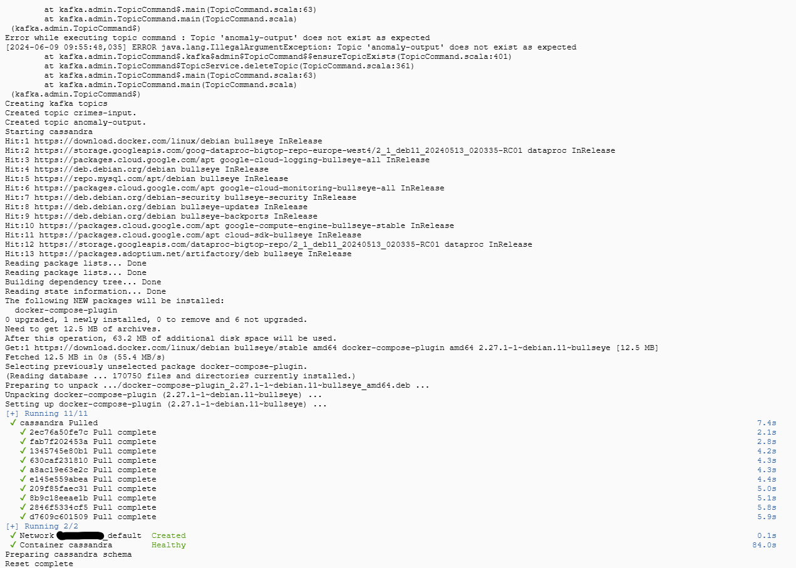

## Producent; skrypty inicjujące i zasilające

1. Uruchom cluster za pomocą komendy:
    ```shell
    gcloud dataproc clusters create ${CLUSTER_NAME} \
    --enable-component-gateway --region ${REGION} --subnet default \
    --master-machine-type n1-standard-4 --master-boot-disk-size 50 \
    --num-workers 2 --worker-machine-type n1-standard-2 --worker-boot-disk-size 50 \
    --image-version 2.1-debian11 --optional-components ZOOKEEPER,DOCKER,FLINK \
    --project ${PROJECT_ID} --max-age=3h \
    --metadata "run-on-master=true" \
    --initialization-actions gs://goog-dataproc-initialization-actions-${REGION}/kafka/kafka.sh
    ```
2. Wrzuć do swojego bucketa pliki z danymi (nie zmieniaj ich domyślnej nazwy)
3. Uruchom 3 terminale SSH na masterze klastra
4. Wrzuć plik zip z projektem korzystając z jednego z terminali
5. Wykonaj komendy:
    ```shell
    unzip projekt2.zip
    chmod +x *.sh
    ```
6. Uruchom skrypt `./reset.sh` w celu zresetowania środowiska
   
7. Uruchom skrypt `./produce.sh` w celu rozpoczęcia generowania danych

## Utrzymywanie obrazu czasu rzeczywistego - transformacje

Na początku dane otrzymywane z tematów Kafki są deserializowane za pomocą klas `CrimeKafkaDeserializationSchema` oraz
`IucrCodeKafkaDeserializationSchema`:

```java

@Override
public void deserialize(ConsumerRecord<byte[], byte[]> record, Collector<Crime> out) {
    Crime crime = new Crime();
    crime.setId(Long.parseLong(new String(record.key())));
    String[] values = new String(record.value()).split(",");
    crime.setDate(LocalDateTime.parse(values[1], formatter));
    crime.setIucrCode(values[2]);
    crime.setArrest(Boolean.parseBoolean(values[3]));
    crime.setDomestic(Boolean.parseBoolean(values[4]));
    if ("\"\"".equals(values[5])) {
        crime.setDistrict(0);
    } else {
        crime.setDistrict(Math.round(Float.parseFloat(values[5])));
    }
    out.collect(crime);
}
```

```java

@Override
public void deserialize(ConsumerRecord<byte[], byte[]> record, Collector<IucrCode> out) {
    IucrCode iucrCode = new IucrCode();
    iucrCode.setCode(getCode(new String(record.key())));
    String[] values = new String(record.value()).split(",");
    iucrCode.setPrimaryDescription(values[1]);
    iucrCode.setSecondaryDescription(values[2]);
    iucrCode.setMonitoredByFbi("I".equals(values[3]));
    out.collect(iucrCode);
}
```

Dane na temat kodów IUCR są broadcastowane, dzięki czemu są przesyłane do każdego task managera.

```java
BroadcastStream<IucrCode> iucrCodeBroadcastStream = iucrSource.broadcast(iucrCodeStateDescriptor);
```

Następnie, aby uniknąć sytuacji, gdzie zdarzenia na temat przestępstw są przetwarzana przed danymi na temat kodów
wykorzystywane jest `ControlFunction`, która buforuje zdarzenia dotyczące danego kodu, dopóki nie zostaną przetwarzone
dane na jego temat. Po zakończeniu tej funkcji obiekty reprezentujące przestępstwa są wzbogacane o informacje na temat
kategorii przestępstwa oraz tego, czy jest ono monitorowane przez FBI. Dodatkowo na tym etapie są przypisywane znaczniki
czasowe oraz watermarki.

```java
DataStream<CrimeFbi> crimeFbiStream = crimesSource
        .connect(iucrSource)
        .keyBy(Crime::getIucrCode, IucrCode::getCode)
        .flatMap(new ControlFunction())
        .connect(iucrCodeBroadcastStream)
        .process(new CrimeFbiEnrichmentFunction(iucrCodeStateDescriptor))
        .assignTimestampsAndWatermarks(
                WatermarkStrategy
                        .<CrimeFbi>forBoundedOutOfOrderness(Duration.ofDays(1))
                        .withTimestampAssigner((event, timestamp) -> event.getDate().toEpochSecond(ZoneOffset.UTC) * 1000));
```

Kolejnym etapem jest funkcja agregująca, która zlicza odpowiednie dane na podstawie klucza składającego się z głównej
kategorii przestępstwa oraz dzielnicy w ramach okna obejmującego jeden miesiąc:

```java
DataStream<CrimeAggregate> aggOutput = crimeFbiStream
        .map(CrimeAggregate::fromCrimeFbi)
        .keyBy(crimeFbi -> Tuple2.of(crimeFbi.getPrimaryDescription(), crimeFbi.getDistrict()),
                TupleTypeInfo.getBasicAndBasicValueTupleTypeInfo(String.class, Integer.class))
        .window(new MonthTumblingEventTimeWindows(properties.get(Parameters.FLINK_DELAY, "C")))
        .reduce((crime1, crime2) -> {
            CrimeAggregate crimeAggregate = new CrimeAggregate();
            crimeAggregate.setMonth(crime1.getMonth());
            crimeAggregate.setPrimaryDescription(crime1.getPrimaryDescription());
            crimeAggregate.setDistrict(crime1.getDistrict());
            crimeAggregate.setCount(crime1.getCount() + crime2.getCount());
            crimeAggregate.setCountArrest(crime1.getCountArrest() + crime2.getCountArrest());
            crimeAggregate.setCountDomestic(crime1.getCountDomestic() + crime2.getCountDomestic());
            crimeAggregate.setCountMonitoredByFbi(crime1.getCountMonitoredByFbi() + crime2.getCountMonitoredByFbi());
            return crimeAggregate;
        });
```

Domyślnie we Flinku nie ma możliwości zdefiniowania okna, które zaczyna się od początku miesiąca, dlatego została
wykonana implementacja na podstawie `TumblingEventTimeWindows`, gdzie należało odpowiednio napisać
metodę `assignWindows`:

```java

@Override
public Collection<TimeWindow> assignWindows(Object element, long timestamp, WindowAssigner.WindowAssignerContext context) {
    LocalDateTime start = Instant.ofEpochMilli(timestamp)
            .atOffset(ZoneOffset.UTC)
            .toLocalDate()
            .withDayOfMonth(1)
            .atStartOfDay();
    long startMilli = start.toEpochSecond(ZoneOffset.UTC) * 1000;
    LocalDateTime end = start.plusMonths(1);
    long endMilli = end.toEpochSecond(ZoneOffset.UTC) * 1000;
    return Collections.singletonList(new TimeWindow(startMilli, endMilli));
}
```

Wyniki agregacji są przekazywane do ujścia będącego bazą danych Cassandra:

```java
public static CassandraSink<CrimeAggregate> getCassandraAggSink(DataStream<CrimeAggregate> input, ParameterTool properties) throws Exception {
    return CassandraSink.addSink(input)
            .setHost(properties.get(Parameters.CASSANDRA_HOST), properties.getInt(Parameters.CASSANDRA_PORT, 9042))
            .build();
}

@Data
@NoArgsConstructor
@AllArgsConstructor
@Table(keyspace = "crime_data", name = "crime_aggregate")
public class CrimeAggregate {
    @Column(name = "month")
    private int month;
    @Column(name = "primary_description")
    private String primaryDescription;
    @Column(name = "district")
    private int district;
    @Column(name = "count")
    private long count;
    @Column(name = "count_arrest")
    private long countArrest;
    @Column(name = "count_domestic")
    private long countDomestic;
    @Column(name = "count_monitored_by_fbi")
    private long countMonitoredByFbi;
}
```

## Utrzymanie obrazu czasu rzeczywistego – obsługa trybu A

Obsługa tego trybu polega na wykorzystaniu wyzwalacza natychmiastowego powtarzalnej aktualizacji. Domyślnie we Flinku
przy użyciu okien jest wykorzystywany wyzwalacz kompletności zatem w celu jego zmiany został wykorzystana
metoda `getDefaultTrigger` w klasie `MonthTumblingEventTimeWindows`:

```java 

@Override
public Trigger<Object, TimeWindow> getDefaultTrigger(StreamExecutionEnvironment env) {
    return delay.equals("A") ? EveryEventTimeTrigger.create() : EventTimeTrigger.create();
}
```

Implementacja `EveryEventTimeTrigger` polega na zwróceniu wartości `FIRE` za każdym razem, gdy nowy element jest
dodawany do okna:

```java

@Override
public TriggerResult onElement(
        Object element, long timestamp, TimeWindow window, TriggerContext ctx) {
    return TriggerResult.FIRE;
}
```

## Utrzymanie obrazu czasu rzeczywistego – obsługa trybu C

Obsługa tego trybu polega na wykorzystaniu wyzwalacza kompletności, który jest domyślnym wyzwalaczem we Flinku przy
użyciu okien: `EventTimeTrigger`.

## Wykrywanie anomalii

## Program przetwarzający strumienie danych; skrypt uruchamiający

W celu uruchomienia przetwarzania należy wykonać skrypt `./run.sh` w jednym z terminali. Skrypt ten można parametryzować
za pomocą flag:

- `--flink-delay` - tryb obsługi utrzymania obrazy czasu rzeczywistego (domyślnie `C`, możliwe `A` lub `C`)
- `--flink-anomaly-period` - długość okresu przy detekcji anomalii, wyrażona w dniach (domyślnie `30`)
- `--flink-anomaly-threshold` - minimalny próg przestępstw rejestrowanych przez FBI przy detekcji anomalii, wyrażony w
  procentach (domyślnie `60`)

### Przykładowe uruchomienie

- wariant 1 - tryb obsługi A, anomalie nie występują
    ```shell
    ./run.sh --flink-delay A --flink-anomaly-period 30 --flink-anomaly-threshold 110
    ```
- wariant 2 - tryb obsługi C, anomalie występują często
    ```shell
    ./run.sh --flink-delay C --flink-anomaly-period 30 --flink-anomaly-threshold 50
    ```

### Uruchomienie z punktami kontrolnymi

W celu uruchomienia przetwarzania ze stanem z punktu kontrolnego należy wykonać skrypt `./run-chekpoint.sh`, gdzie
pierwszym argumentem jest nazwa katalogu z punktem kontrolnym. Katalog ten można uzyskać za
pomocą `hadoop fs -ls /tmp/flink-checkpoints`). Jako argument trzeba przekazać pełną ścieżkę do katalogu `chk-XXX` np.
`hdfs:///tmp/flink-checkpoints/abcd1234/chk-100`.

